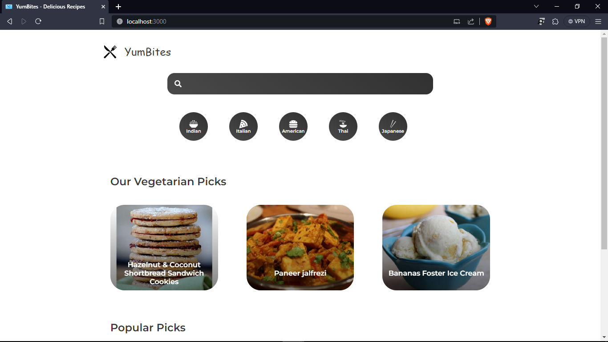

# Recipe Website - React.js

Welcome to the Recipe Website project built with React.js and powered by the Spoonacular API. This website allows users to explore a variety of recipes, find cooking inspiration, and discover new dishes.

## Website Preview:



## Features

- Browse a collection of delicious recipes.
- Search for recipes based on ingredients, cuisine, or dietary preferences.
- View detailed recipe information, including ingredients, instructions, and nutritional facts.
- Responsive design for a seamless experience on various devices.

- ## Demo

You can try out the live demo of the Recipe Website here: [Demo Link](https://aakash-rajbhar.github.io/Recipe-Website)

## Getting Started

Follow these steps to set up the project locally on your machine:

1. Clone the repository:

```bash
git clone https://github.com/your-username/recipe-website.git
```

```bash
cd recipe-website
```

```bash
npm install
```

```bash
npm start
```

Open your web browser and visit http://localhost:3000 to view the website.

Usage
<p>Browse recipes: Explore a wide range of recipes by clicking on the available categories or using the search functionality.</p>
<p>Search for recipes: Use the search bar to find recipes based on ingredients, cuisine, or dietary preferences.</p>
<p>View recipe details: Click on a recipe card to view detailed information, including ingredients, instructions, and nutritional facts.</p>


This project uses the Spoonacular API to fetch recipe data. To use the API, you need to obtain an API key from Spoonacular. Once you have the API key, create a .env file in the project root directory and add the following:

```bash
REACT_APP_SPOONACULAR_API_KEY=your-api-key-here
```


##Contributing
Contributions are welcome! If you'd like to contribute to this project, please follow these guidelines:

-Fork the repository.<br>
-Create a new branch for your feature or bug fix: git checkout -b feature-name.<br>
-Make your changes and commit them: git commit -m 'Add new feature'.<br>
-Push to the branch: git push origin feature-name.<br>
-Create a pull request to merge your changes into the main branch.<br>

Feel free to ask your queries and drop comments.

